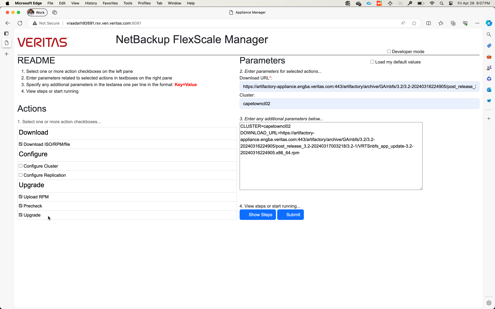
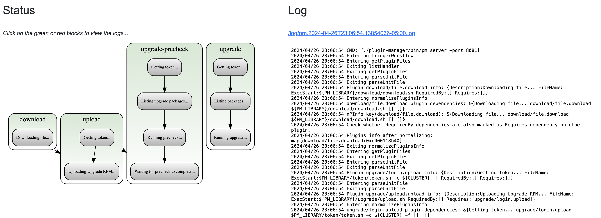

# Appliance Manager

An utility aimed at managing NBFS appliance using published NBFS REST APIs and [Plugin Manager](https://github.com/VeritasOS/plugin-manager).

> Table of Contents

- [Appliance Manager](#appliance-manager)
  - [Setup Instruction](#setup-instruction)
  - [Appliance Manager UI](#appliance-manager-ui)

## Setup Instruction

Setting up Appliance Manager involves following steps:

1. Get latest version of [Plugin Manager v2](https://github.com/VeritasOS/plugin-manager/tree/v2), and check out v2 branch. Build by running `make build` inside `plugin-manager` to get `pm` binary.
1. Set `PM_WEB` environment variable to point to `web` directory.
1. Start Plugin Manager server: `pm server -port <port-number>`.
1. Appliance Manager can now be accessed via `http://{{server}}:{{port-number}}/`.

## Appliance Manager UI

1. Select actions and specify parameters as shown below:

1. Click on View steps to see the tasks involved:

